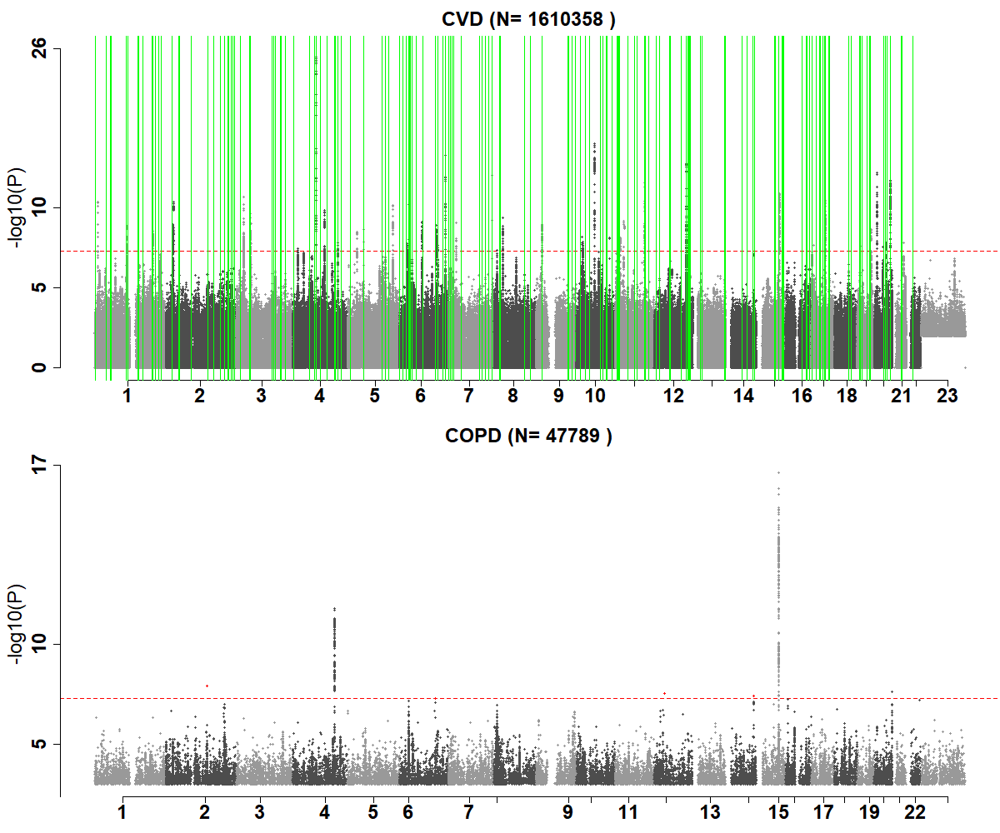
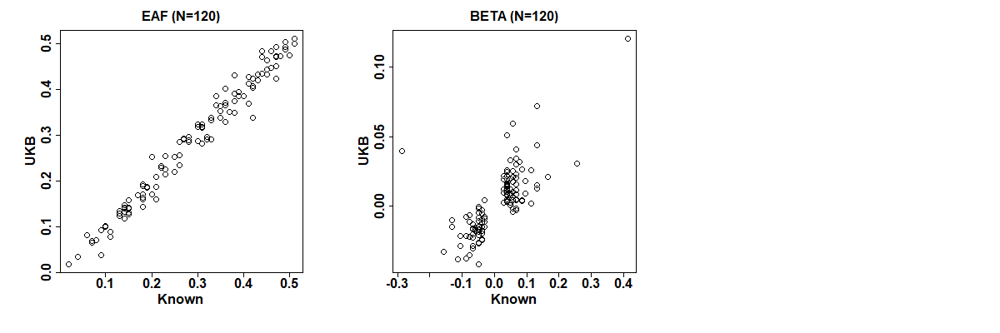

<br/>
<br/>

# #1. 下载和处理国际上公用公开的数据

这是初二生物学课本里面的内容哦！


#1.1 HAPMAP3 genotype 数据, 一般作为 LD 计算的 reference panel
```
打开 https://www.broadinstitute.org/medical-and-population-genetics/hapmap-3， 
点击 How To Download This Release 下面的 A. SNP Genotype Data 段落的中间3个链接。
文件名字里面有 "b36"，现在一般都用 b37（比如 UK Biobank），甚至有的用 b38，
所以下载后解压后需要将那个 .map 文件先用 liftOver 转化为 b37 格式，然后用 PLINK 生成 bed/bim/fam 文件。
这一步已经完成，生成的 PLINK 格式文件已经放到百度网盘，请大家下载。
这个基因数据将作为我们组进行 LDSC 和 GSMR 分析的标准文件。

```

#1.2. 1000 genomes (千人基因组) genotype 数据， 一般作为 imputation 的 reference panel.

```
打开 https://www.internationalgenome.org/data，在 Available data 下面，点击该页面 Phase 3 对应的 VCF 链接，
可以看到以 “ALL.” 开头的文件，可以一个一个直接点击链接下载。
也可以用下面的命令下载, 并且随之将下载的VCF文件转换为PLINK格式

由于 chrX, chrY, chrMT 的文件名字跟其它染色体不同，用下面的命令下载的时候，里面的文件名字也需要相应调整。 

for chr in {1..22}; do
  wget ftp://ftp.1000genomes.ebi.ac.uk/vol1/ftp/release/20130502/ALL.chr$chr.phase3_shapeit2_mvncall_integrated_v5a.20130502.genotypes.vcf.gz
  wget ftp://ftp.1000genomes.ebi.ac.uk/vol1/ftp/release/20130502/ALL.chr$chr.phase3_shapeit2_mvncall_integrated_v5a.20130502.genotypes.vcf.gz.tbi
  mv ALL.chr$chr.phase3_shapeit2_mvncall_integrated_v5a.20130502.genotypes.vcf.gz g1k.chr$chr.gz # 简化文件名字
  plink --vcf g1k.chr$chr.vcf.gz --make-bed --out g1k.chr$chr # 一般没有必要这样做，因为PLINK和很多软件都可以直接读取VCF文件
done  

除了下载上述页面上以 “ALL.” 开头的 VCF 文件，倒数第二个 integrated_call_samples_v3.20130502.ALL.panel 文件罗列了每一个样本的人群（pop）和人种 (super_pop)，以及性别。
根据这个文件，可以提取特定人种的样本，比如：
awk '$3=="EUR" {print $1,$1}' integrated_call_samples_v3.20130502.ALL.panel > g1k.EUR.keep
awk '$3=="EAS" {print $1,$1}' integrated_call_samples_v3.20130502.ALL.panel > g1k.EAS.keep

然后可以用 PLINK --keep g1k.EUR.keep 生成某一个特定人种的基因数据。当然，如果不想生成太大的基因数据，就只保留一个所有人的数据，后续的PLINK命令记得用 --keep g1k.EUR.keep 就行。

不论是有所有2504个人基因数据的PLINK文件，还是只有某一个人种的PLINK文件，每个染色体都是单独的文件。
后续跑 GWAS 或提取 PRS 的时候，也是每条染色体的数据分开来跑，这样就可以进行并行计算（parallel computing）。
一般不建议把所有的染色体的数据合并成一个完整的单一的基因数据，毕竟8千多万个SNP，文件太大了，很多软件根本运行不了。

```

其实，PLINK的网站上也有千人基因组的数据，点击左下方菜单“1000 genomes phase3” 链接，按照操作下载和处理。
不管是哪个方法得到的PLINK格式的数据，有的软件不允许 .bim 文件里面的 SNP 名字有重复，这个时候可以用下面的命令来处理

```
cp chr1.bim chr1.bim.COPY
awk '{if(array[$2]=="Y") {i++; $2=$2".DUP"i}; print $0; array[$2]="Y"}' chr1.bim.COPY > chr1.bim 

```


<br/>
<br/>

# #2.  提取 UKB 一般表型数据


有人做了一个 ukbtools 的R软件包，但我觉得不是太好用，并且很慢。
https://kenhanscombe.github.io/ukbtools/articles/explore-ukb-data.html
如果你们有兴趣，可以参考这个，可以用两种不同的方法来提取数据，进行比较


#2.1 只有一列或者少数计列的一般表型（age, sex, race, bmi, etc.）

WINDOWS电脑建议安装系统自带的Ubuntu Linux系统，cd /mnt/d/。下载UKB小程序ukbunpack, unbconv, encoding.ukb 等。
苹果电脑，参考 https://github.com/spiros/docker-ukbiobank-utils。
打开ukbiobank.ac.uk, 点击中间的 Data Showcase 菜单。然后点击第一个“Essential Information”，阅读 Access and using your data。
写一个 VIP.fields.txt 文件，列出想提取的变量和对应的 data-field，比如 21022 age

```
unkunpack ukb42156.enc 【数据密码】
awk '{print $1}' ukb.vip.fields > ukb.vip.fields.id
sort ukb.vip.fields.id | uniq -d
ukbconv ukb42156.enc_ukb r -iukb.vip.fields.id -ovip

```

```
打开R ，用下面的几行代码，将上面生成的 vip.tab 数据读入，并且给每个变量赋予正确的名字。
下面的XXXX是文件路径，上述Linux 系统生成的 vip.r文件，如果在Windows 系统里面运行R，需要修改文件的路径。

source("D:/XXXX/vip.r")
pnames <- read.table("D:/XXXX/ukb.vip.fields", header=F)
pnames$V1 <- paste0("f.", pnames$V1, ".0.0")
phe <- subset(bd, select=grep("f.eid|\\.0\\.0", names(bd)))

```


#2.2 跨越很多列的 ICD 数据（data field 42170）以及其想对应的日期，父母家族病史的数据

```
# ICD 这样的指标，包含了很多不同时间的时间点，量很大，建议分开来处理。
ukbconv ukb42156.enc_ukb r -s42170 -oicd
sed -i 's/"//g icd.tab

# 将 icd.tab 文件整合为两列，便于读入R。
cat icd.tab | sed -e 's/\tNA//g' -e 's/\t/,/2g' | \
awk '{ if(NR==1) print "IID icd"; else if (NF==1) print $1 " NA"; else print $0"," }' > icd.2cols

# 从 ICD.2cols 文件里面提取某一个变量，比如 bipolar（对应的ICD-10代码F31），用R读入数据后，生成一个 0/1/NA 变量。
phe$icd_bipolar = ifelse("F31", phe$icd10), 1, ifelse(“F”, phe$icd10), NA, 0))

# 如果需要批量处理很多ICD变量，先写一个 VIP.icd.txt 文件，第一列是ICD代码，第二列是相对应的变量的名字，比如I350|I35  stenosis，“|”表示“或者”。
# 这个文件第一行写上 codes names，然后用下面的R代码批量执行。
ICDnames <- read.table("ukb.vip.icd10", header=T)
for (i in 1:nrow(ICDnames)) { 
  phe[[paste0("icd_",ICDnames$names[i])]] = ifelse( grepl(ICDnames$codes[i], phe$icd10), 1, ifelse(grepl( substring(ICDnames$codes[i],1,1), phe$icd10), NA,0)) 
}

```

```
## 对于绝大多数的 ICD code, UKB 里面有 First occurances 的数据，比如 http://biobank.ndph.ox.ac.uk/showcase/field.cgi?id=131492。
## 如果想自己通过写代码来做，可以先提取ICD （data field 42170）以及相对应的日期（data field 42180）, 然后提取单个ICD 的Date, 比如COPD (代码J440，不是J44)。
## 对 Dementia 这种有多个个ICD 代码的 (F00|F01|F02|F03|G30)，可以分别生成 icdDate.F00.2cols, icdDate.F01.2cols，等。然后在R里面合并文件并找出每人的最小日期。

echo -e "41270\n41280" > icd-date.fields.ids
ukbconv ukb42156.enc_ukb r -iicd-date.fields.ids -oicd-date
sed -i 's/"//g' icd-date.tab

cnt=`head -1 icd-date.tab | awk '{printf NF}'` # 找出文件的列数
awk -v cn=$cnt -v co="J440" '{if (NR==1) print "IID", co; else {c=(cn-1)/2; printf $1;  
    for (i=2; i<=(c+1); i++) { if ($i==co) printf " "$(i+c) } printf "\n"  }}' icd-date.tab | awk 'NF==2' > icd-date.2cols

```

#2.3. 对表型数据进行 GWAS 运行之前的处理

提取需要研究的表型数据和相关的covariates，比如 age, sex, PCs。一般来说，quantitative的表型数据要 adjust for covariates 和转化成正态分布，这个可以在R里面用下面的命令来实现。
对于疾病的binary 表型，只需要把需要 adjust 的covarites 和表型数据放在同一个表型数据文件里面，然后在 GWAS里面的命令指明哪个是表型，哪些是 covariates。

```
trait_res = residuals(lm(trait ~ age+sex+PC1+PC2, na.action=na.exclude)
trait_inv = qnorm((rank(trait_res,na.last="keep")-0.5) / length(na.omit(trait_res)))

```


# #3. GWAS 运行


目前GWAS 由专人负责运行，一般来说就是通过下面这样的PLINK命令来跑

```
for chr in {1..22}; do
   plink2 --memory 12000 --threads 16 --pfile ukb/imp/chr$chr --extract ukb.chr$chr.good.snps --pheno pheno/cvd.EUR.pheno --no-psam-pheno --pheno-name XXX --1 --glm cols=+ax,+a1freq,+a1freqcc,+a1count,+a1countcc,+beta,+orbeta,+nobs hide-covar no-x-sex --covar pheno/ukb.cov --covar-name age,sex,PC1-PC10 --out chr$chr

```
上述命令顺利跑完后，确认生成的文件没有问题后，可以把所有的染色体的数据串到一起，形成一个单一的 XXX.gwas.gz 文件。鉴于2千多万个SNP，文件太大，我们一般只保留：P<0.01的SNP 以及那些在Hapmap3 里面的SNP。最终合并成的 XXX.gwas.gz 文件用 TAB 分割，CHR:POS 排好序，要不然 LocusZoom 那样的软件不能处理。也可以用 tabix -f -S 1 -s 1 -b 2 -e 2 XXX.gwas.gz 对数据进行索引，便于 LocalZoom 那样的软件去处理。


如果想找公开的GWAS数据进行练手，或对比，可以从以下链接下载公开的GWAS数据
```
1. 哈佛医学院附属麻省总医院：http://www.nealelab.is/uk-biobank
2. 哈佛医学院附属麻省总医院：Cardiovascular disease genomics http://www.broadcvdi.org/
3. 西湖大学杨剑：fastgwa.info
```


# #4. 单个 GWAS 数据的分析

#4.1 画一个 Manhattan Plot, 除了公用的 qqman package 之外，可以用我的 mhplot.R 和 mhplot.f.R 代码，前者 call 后者。
我的代码可以：多个图画在同一页上，红色显示 rare variants, 添加绿色的已发表的SNP，等。
为了保证所有的图的横坐标位置对齐，我的代码用到了每个染色体的地标（dibiao），可以用下面的代码生成
```
echo -n > ukb.chrom.pos.b37
for chr in {1..22} X; do
  head -1 ukb_mfi_chr${chr}_v3.txt | awk -v c=$chr '{print c, $3}' >>  ukb.chrom.pos.b37 
  tail -1 ukb_mfi_chr${chr}_v3.txt | awk -v c=$chr '{print c, $3}' >>  ukb.chrom.pos.b37   
done
```



#4.2 从GWAS catalog (https://www.ebi.ac.uk/gwas) 寻找该GWAS的文章和SNP，用 compareP.R 和 compareP.f.R 确认该GWAS和已发表的结果大致相同。
下面的这个图，显示某篇已经发表的CAD的GWAS报道的SNP，跟UKB的结果比较。由于那个文件里面没有P值，所以只画出了 EAF 和 BETA这两个比较图。

已发表的文章中的图


我们的数据画出来的图



#4.3 提取GWAS里面的的统计显著性（significant）信号，添加简单的注释（比如所在的基因名称）

使用 PLINK (https://www.cog-genomics.org/plink/1.9/) 左边菜单中的 Report postprocess 中的 3个命令（--annotate, --clump, --gene-report）


```
trait=MI

gunzip -c $trait.gwas.gz | sed '1 s/ POS/ BP/' > $trait.gwas.txt # 以后就不需要 sed 这一步了

plink --annotate $trait.gwas.txt NA ranges=glist-hg19 --border 10 --pfilter 5e-8 --out $trait.top

## 由于 千人基因组 (g1k) 的基因数据过大（将近1亿个SNP），一般讲每一个染色体的GWAS数据分开来 clump
## plink clump 的结果，不包括那些 --bfile 里面没有的SNP，所以得要把那些SNP再添加到 clump 的结果里。
## 可惜 PLINK的作者 Chris Chang不想解决这个问题，请见 https://groups.google.com/g/plink2-users/c/DacWWAPvGE0/m/uH8NVYq_CQAJ
for chr in {1..22}; do
   plink1.9 --vcf g1k.chr$chr.vcf.gz --clump $trait.gwas.txt --clump-p1 5e-08 --clump-p2 5e-08 --clump-kb 1000 --clump-r2 0.2 --out $trait.chr$chr
   awk '$1 !="" {print $3,$1, $4,$5}' $trait.chr$chr.clumped > $trait.chr$chr.top
done

## 通过LD的计算来找到GWAS数据里面的independent top hits，也有一些问题（比如g1k的LD不是金标准，r2也不是最合理的筛选办法），并且计算量很大。 
## 下面这个简单的代码可以寻找GWAS数据里面每1MB区间的top SNP，不考虑LD。假设GWAS的第1，2，3 列分别是 SNP, CHR, POS，最后一列是P。
zcat ABC.gwas.gz | awk 'NR==1 || $NF<5e-8 {b=sprintf("%.0f",$3/1e6); print $1,$2,$3,$NF,b}' | sort -k 2,2n -k 5,5n -k 4,4g | awk '{if (arr[$NF] !="Y") print $0; arr[$NF] ="Y"}' 

```

#4.4 如果不考虑 SNP之间的LD，就是单纯的根据 P值和 CHR：POS 将所有的显著信号划分为1MB的片区，可以用下面的 AWK 命令。
该命令假设GWAS数据的第1，2，3 列 分别是 CHR, POS, SNP，最后一列是P 值。

```
awk '{b=sprintf("%.0f",$2/1e6); print $3,$1,$2,$NF,b}' TRAIT.p5e-8 | sort -k 2,2n -k 5,5n -k 4,4g | awk '{if (arr[$NF] !="Y") print $0; arr[$NF] ="Y"}' > TRAIT.loci

```
要把上述得到的显著区域跟别人已经发表的 SNP进行比较，看是不是有重叠（1MB范围之内的重叠都算），可以用下面的 bedtools 命令。 
该文件需要将 A 和 B 两个文件转换成 bed 格式，并把其中的一个文件的SNP的位置，左右各扩张1MB，
比如A文件中的某个 rsXYZ 位于1号染色体上的3000000 位置，那么bed 文件中就写： 1  2000000  2000000   rsXYZ
如果起始位置出现负数，一定要将负数改为 0。
```
bedtools intersect -a A.bed -b B.bed -wo
```

GWAS 的数据直接导入 LocusZOOM (http://locuszoom.org), 轻松得到 Manhattan Plot, Top Loci Table, 以及任何基因组区域的 locuszoom 图。有关问题，请参考我跟对方的沟通 https://github.com/statgen/locuszoom-hosted/issues/19

#4.5 生成 PRS
我们可以根据任何一个GWAS，来计算UKB里面每个人的PRS，当然也可以计算任何人包括我们自己的PRS，只要我们有基因数据就行。
相关的方法学，请参考经典版的PLINK （http://zzz.bwh.harvard.edu/plink/profile.shtml）和新版的PLINK1.9 （https://www.cog-genomics.org/plink/1.9/score）
由于UKB的基因数据很大，一般是将22条染色体分别运行，命令如下：

```
for chr in {1..22}; do
      plink2 --pfile chr$chr --score chr$chr.ref 1 2 3 header no-mean-imputation cols=+scoresums list-variants --out chr$chr
done
```
生成的PRS，可以用来评估 PRS 对疾病（比如 Alzhermer's Disesase）的影响，实例代码如下：
```
pacman::p_load(data.table, dplyr, ggplot2, tidyverse, magrittr, survival, survminer)

dat0 <- readRDS("D:/data/ukb/Rdata/ukb.phe.rds")
dat0 <- subset(dat0, select=grep("IID|array|race|eth|related|age|sex|Ill|bmi|attend|birth|death|smoke|alcohol|PC1$|PC2$|apoe|_ad|_dementia|dep|dis|bb_|bc_", names(dat0))) 
prs = read.table(gzfile('D:/data/ukb/prs/dementia.prs.gz','r'), header=T, as.is=T) 
dat <- merge(dat0, prs, by="IID") %>%
	rename(date_dx = date_dementia) %>%
	filter( race=="White" & age >=60 & !grepl("e1",apoe) ) %>% 
	mutate( 
		dx = ifelse( is.na(date_dx), 0,1),
		lastday = fifelse(!is.na(date_dx), date_dx, fifelse(!is.na(death_date), death_date, as.Date("2018-02-28"))),
		followyears = (as.numeric(lastday) - as.numeric(date_attend)) / 365.25
	) %>%
	filter( followyears >0 ) %>% 
	mutate (
		prs_qt = cut(prs, breaks=quantile(prs, probs=seq(0,1,0.2), na.rm=T), include.lowest=T, labels=paste0("q",1:5)),
		prs_grp = ifelse(prs_qt=="q1", "low", ifelse(prs_qt=="q5", "high", "middle")),
		prs_grp = factor(prs_grp, levels=c("low","middle","high"))
	)

### replicate analysis results ###
table(dat$dx, useNA="always"); hist(dat$followyears)
sum(dat$followyears) #1,545,433 person-years reported in paper
round(prop.table(table(dat$prs_grp, dat$dx), 1) ,3) # 1.23% vs. 0.65% reported in paper
surv.obj <- Surv(time=dat$followyears, event=dat$dx)
summary(cox.fit <- coxph(surv.obj ~ age+sex + smoke_status+alcohol_status + prs, data=dat))
ggforest(cox.fit, data=dat)
```
 
#4.6 单个GWAS的数据的深度分析 

```
基因国际上大量样本的 SNP频率 和基本注解查询： GnomAD: https://gnomad.broadinstitute.org

生物学功能查询 VEP: http://grch37.ensembl.org/info/docs/tools/vep/index.html

一站式解决方案 post-GWAS analysis pipeline github.com/Ensembl/postgap

多基因风险评分PRS

PRSice: https://github.com/choishingwan/PRSice
LDpred2 https://privefl.github.io/bigsnpr/articles/LDpred2.html
```


# #5. 多个GWAS 之间的分析（哈佛公卫学院梁黎明 三套马车方案）

#5.1. genetic correlation 分析, LDSC (https://github.com/bulik/ldsc)

```
source activate ldsc
for trait in $traits; do
	zcat $dir/gwas/$trait.sumstats.gz | awk 'NF==5' | sed -e 's/\.000$//' -e 's/\t/ /g' | gzip -f > $trait.sumstats.gz 
done
for train in $traits; do
    echo $trait $traits | sed -e 's/ /.sumstats.gz,/g' -e 's/$/.sumstats.gz/' | \
    	xargs -n1 -I % /mnt/d/software_lin/ldsc/ldsc.py --rg % --out $trait --ref-ld-chr $ld_dir --w-ld-chr $ld_dir
 #   awk '$1=="Summary" {printf NR}' $trait.log | xargs -n1 -I % awk -v s=% 'FNR >=s' *.log | sed 's/.sumstats.gz//g' > $trait.ldsc.txt
done
```


#5.2. 因果分析 Mendelian Randomization，GSMR (https://cnsgenomics.com/software/gcta/#GSMR)

我们建议用 hapmap3 的数据作为 LD reference。
如果用上述提取的千人基因组数据作为 LD 参考，由于数据是按照染色体分开的，就需要用 --mbfile （而不是 --bfile）。
!!! GCTA 对文件的格式有比较固定和严格的要求，SNP A1 A2 freq b se p N 必须按照这个顺序！！！

```
dir=/mnt/d/projects/001cvd
trait1=artery
trait2=copd
for trait in $trait1 $trait2; do
	echo "SNP A1 A2 freq b se p N" > $trait.gcta.txt
	zcat $dir/gwas/$trait1.gwas.gz | awk 'NR>1 {print $1, $4, $5, $9, $11,$12, $14, $10}' >> $trait.gcta.txt
done
echo "$trait1 $trait1.gcta.txt" > test.exposure
echo "$trait2 $trait2.gcta.txt" > test.outcome
gcta64 --bfile hapmap3/g1k.b37 --gsmr-file test.exposure test.outcome --gsmr-direction 2 --gwas-thresh 1e-5 --effect-plot --out test

```


#5.3. TWAS (http://gusevlab.org/projects/fusion/)

```
dir_tw=/mnt/d/data/twas_data
dir_gt=$dir_tw/GTEx_v7_multi_tissue
dir_ld=$dir_tw/LDREF
fusion=/mnt/d/software_lin/fusion_twas
for trait in RHR T2D; do
for tissue in `ls -d1 $dir_gt/*/ | sed 's/\/$//' | awk -F '/' '{print $NF}' | awk '{printf " "$1}'`; do
for chr in 7; do
    echo now process trait $trait, tissue $tissue, chr $chr
    Rscript $fusion/FUSION.assoc_test.R --sumstats $dir/summary/$trait.sumstats.gz --chr $chr --out $trait.$tissue.chr$chr.txt \ 
    	--weights $dir_gt/$tissue.P01.pos --weights_dir $dir_gt --ref_ld_chr $dir_ld/1000G.EUR.
done
done
done
```


# # 参考文献和网站

```
英国 UK biobank: https://ukbiobank.ac.uk
美国 All of US (奥巴马总统称之为 Precision Medicine Initiative): https://databrowser.researchallofus.org/
TopMed browser: https://bravo.sph.umich.edu/
Gnomad browser: https://gnomad.broadinstitute.org/
UCSC genome browser: https://www.genome.ucsc.edu/
dbSNP: https://www.ncbi.nlm.nih.gov/snp/

2018. Adult height and risk of 50 diseases: a combined epidemiological and genetic analysis
 
2019. JACC. Genome-Wide Assessment for Resting Heart Rate and Shared Genetics With Cardiometabolic Traits and Type 2 Diabetes
Genome Wide Assessment of Shared Genetic Architecture Between Rheumatoid Arthritis and Cardiovascular Diseases Using the UK Biobank Data 

2019. JAMA. Association of Lifestyle and Genetic Risk With Incidence of Dementia
```

