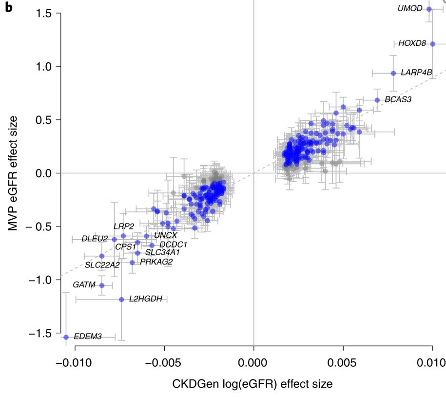

<br/>
<br/>

# #1. 下载和处理国际上公用公开的数据

## 这是初二生物学课本里面的内容哦！


## #1.1 HAPMAP3 genotype 数据, 一般作为 LD 计算的 reference panel

> 打开 <https://www.broadinstitute.org/medical-and-population-genetics/hapmap-3>， 
> 点击 How To Download This Release 下面的 A. SNP Genotype Data 段落的中间3个链接。
> 文件名字里面有 "b36"，现在一般都用 b37（比如 UK Biobank），甚至有的用 b38，
> 所以下载后解压后需要将那个 .map 文件先用 liftOver 转化为 b37 格式，然后用 PLINK 生成 bed/bim/fam 文件。
> 这一步已经完成，生成的 PLINK 格式文件已经放到百度网盘，请大家下载。  
> 这个基因数据将作为我们组进行 LDSC 和 GSMR 分析的标准文件。
<br/>

## #1.2. 1000 genomes (千人基因组) genotype 数据， 一般作为 imputation 的 reference panel.

> 打开 https://www.internationalgenome.org/data，在 Available data 下面，点击该页面 Phase 3 对应的 VCF 链接，
> 可以看到以 “ALL.” 开头的文件，可以一个一个直接点击链接下载。
> 也可以用下面的命令下载, 并且随之将下载的VCF文件转换为PLINK格式
> 除了下载上述页面上以 “ALL.” 开头的 VCF 文件，倒数第二个 integrated_call_samples_v3.20130502.ALL.panel 文件罗列了每一个样本的人群（pop）和人种 (super_pop)，以及性别。
> 根据这个文件，可以提取特定人种的样本，比如：
> > - awk '$3=="EUR" {print $1,$1}' integrated_call_samples_v3.20130502.ALL.panel > g1k.EUR.keep
> > - awk '$3=="EAS" {print $1,$1}' integrated_call_samples_v3.20130502.ALL.panel > g1k.EAS.keep
>
> 然后可以用 PLINK --keep g1k.EUR.keep 生成某一个特定人种的基因数据。
> 当然，如果不想生成太大的基因数据，就只保留一个所有人的数据，后续的PLINK命令记得用 --keep g1k.EUR.keep 就行。
> 不论是有所有2504个人基因数据的PLINK文件，还是只有某一个人种的PLINK文件，每个染色体都是单独的文件。
> 后续跑 GWAS 或提取 PRS 的时候，也是每条染色体的数据分开来跑，这样就可以进行并行计算（parallel computing）。
> 一般不建议把所有的染色体的数据合并成一个完整的单一的基因数据，毕竟将近一个亿的SNP，文件太大了，很多软件根本运行不了。

> 其实，PLINK的网站上也有千人基因组的数据，点击左下方菜单“1000 genomes phase3” 链接，按照操作下载和处理。
> 不管是哪个方法得到的PLINK格式的数据，有的软件不允许 .bim 文件里面的 SNP 名字有重复，这个时候可以用下面的命令来处理
> > - cp chr1.bim chr1.bim.COPY
> > - awk '{if(array[$2]=="Y") {i++; $2=$2".DUP"i}; print $0; array[$2]="Y"}' chr1.bim.COPY > chr1.bim 
<br/>


# #2.  提取 UKB 表型数据


## #2.1 关于UKB 基因数据
> 首先要明确，UKB的基因数据很大，所有申请者都能得到一样的数据（样本的ID不一样），一般下载到服务器上去储存和使用。
> 但是，对于基因型的 summary statistics，是可以人人免费下载的。
> UKB里面的将近一亿个 SNP 的 rsID, CHR, POS, MAF等信息，可以点击上面这个页面上的 Imputation。
> 然后弹出来的页面上会有下面这句话, 点击链接下载就行了。
> > The information scores and minor allele frequency data for the imputed genotypes (computed with QCTOOL) can also be downloaded in Resource 1967。

> 对于表型数据的提取，有人做了一个 ukbtools 的R软件包，https://kenhanscombe.github.io/ukbtools/articles/explore-ukb-data.html。
> 但我觉得不是太好用，并且很慢。可以参考这个，用两种不同的方法来提取数据，进行比较。
<br/>

## #2.2 只有一列或者少数计列的一般表型（age, sex, race, bmi, etc.）

WINDOWS电脑建议安装系统自带的 Ubuntu Linux系统，然后用 cd /mnt/d/ （而不是 D:/）进入 D 盘。
打开ukbiobank.ac.uk, 点击 Data Showcase 菜单。然后点击第一个“Essential Information”，阅读 Access and using your data。
读完整个文档的话，你就什么都知道了。苹果电脑，参考 https://github.com/spiros/docker-ukbiobank-utils

1. 先解压表型数据的大文件
    - unkunpack ukb42156.enc 48?0?6475f14648f8a114?5279c06b64a78aa70454efb55b00cc1510e5?db372

2. 写一个 VIP.fields.txt 文件，列出想提取的变量和对应的 data-field，比如 
    - 21022 age

3. 然后用下面的命令，提取出该文件的第一列
    - awk '{print $1}' ukb.vip.fields > ukb.vip.fields.id

4. 确认没有重复的 data-field
    - sort ukb.vip.fields.id | uniq -d

5. 提前VIP 文件里面列出的变量
    - ukbconv ukb42156.enc_ukb r -iukb.vip.fields.id -ovip
	
6. 打开R ，用下面的几行代码，将上面生成的 vip.tab 数据读入，并且给每个变量赋予正确的名字。
    - source("D:/vip.r")
    - pnames <- read.table("D:/ukb.vip.fields", header=F)
    - pnames$V1 <- paste0("f.", pnames$V1, ".0.0")
    - phe <- subset(bd, select=grep("f.eid|\\.0\\.0", names(bd)))

7. 上述Linux 系统生成的 vip.r文件，如果在Windows 系统里面运行R，需要将里面的 /mnt/d 改为 D:/。
<br/>


## #2.3 跨越很多列的数据，比如 ICD (data field 42170）

> ICD 这样的指标，包含了很多不同时间的时间点，量很大，建议分开来处理。
> > ukbconv ukb42156.enc_ukb r -s42170 -oicd
> > sed -i 's/"//g icd.tab

> 将 icd.tab 文件整合为两列，便于读入R。
> > cat icd.tab | sed -e 's/\tNA//g' -e 's/\t/,/2g' | \
> > awk '{ if(NR==1) print "IID icd"; else if (NF==1) print $1 " NA"; else print $0"," }' > icd.2cols
<br/>

## #2.4. 对表型数据进行 GWAS 运行之前的处理

> 提取需要研究的表型数据和相关的covariates，比如 age, sex, PCs。
> 一般来说，quantitative的表型数据要 adjust for covariates 和转化成正态分布，这个可以在R里面用下面的命令来实现。
> > trait_res = residuals(lm(trait ~ age+sex+PC1+PC2, na.action=na.exclude)
> > trait_inv = qnorm((rank(trait_res,na.last="keep")-0.5) / length(na.omit(trait_res)))

> 对于疾病的binary 表型，只需要把需要 adjust 的covarites 和表型数据放在同一个表型数据文件里面，
> 然后在 GWAS里面的命令指明哪个是表型，哪些是 covariates。
<br/>


# #3. GWAS 运行


<br/>

## #3.1 专人在服务器上运行

> 目前GWAS 由专人负责运行，一般来说就是通过下面这样的PLINK命令来跑
> > for chr in {1..22}; do
> > - plink2 --memory 12000 --threads 16 --pfile chr$chr --extract ukb.chr$chr.good.snps --pheno cvd.EUR.pheno --no-psam-pheno --pheno-name XXX --1 --glm cols=+ax,+a1freq,+a1freqcc,+a1count,+a1countcc,+beta,+orbeta,+nobs hide-covar no-x-sex --covar pheno/ukb.cov --covar-name age,sex,PC1-PC10 --out chr$chr   
> > done

> 上述命令顺利跑完后，确认生成的文件没有问题后，可以把所有的染色体的数据串到一起，形成一个单一的 XXX.gwas.gz 文件。鉴于2千多万个SNP，文件太大，我们一般只保留：P<0.01的SNP 以及那些在Hapmap3 里面的SNP。最终合并成的 XXX.gwas.gz 文件用 TAB 分割，CHR:POS 排好序，要不然 LocusZoom 那样的软件不能处理。也可以用 tabix -f -S 1 -s 1 -b 2 -e 2 XXX.gwas.gz 对数据进行索引，便于 LocalZoom 那样的软件去处理。
<br/>

## #3.2 公开的GWAS数据进行练手，或对比

> 最经典的，历史悠久的 GWAS Catalog: https://www.ebi.ac.uk/gwas

> UKB GWAS 完整的分析结果，网上发布
> > - 美国哈佛大学：http://www.nealelab.is/uk-biobank 
> > - 英国爱丁堡大学：geneatlas: http://geneatlas.roslin.ed.ac.uk

> 日本生物样本库的 GWAS：http://jenger.riken.jp/en/result 
> > ***对于这上面的每一个表型，点击最后一列，查看曼哈顿图和QQ图，然后点击那个页面上的 Download summary statistics。否则，前面一页的 download 下来的数据没有 rsID***

> 各大专项疾病领域的GWAS，比如：
> > - 哈佛大学的CVD knowlege portal: https://hugeamp.org/
> > - 南加州大学的神经影像基因组国际合作团队：http://enigma.ini.usc.edu/

>  ***如果下载下来的数据是VCF 格式，可以用 bcftools query 提取需要的 data fileds，生成 TXT 格式。bcftools query 的使用，请参考 http://samtools.github.io/bcftools/bcftools.html***

<br/>

## #3.3 网上下载下来的GWAS数据的格式化
别人发布到网上的数据，可能不是用rsID，而是类似 CHR:POS_REF_ALT 这样的格式。
这个时候可以通过下面这么的代码，跟前面提到的 UKB上将近一亿个SNP的参考信息进行合并，然后改成 rsID 格式。
第一步是提取UKB里面的位点。如果你的GWAS的位点有几百万甚至几千万个SNP，这个时候最好是对每一个 CHR 进行分开处理。
第二部是合并。这里的 join_file.py 是我写的，使用了多年，可以合并多个文件。该代码的优点是，合并后的数据顺序跟第一个文件的一模一样，而其它的很多合并命令或软件会很慢，会打乱顺序。
这个地方不建议采用 ANNOVAR 那样的软件来做。因为用 ANNOVAR 来出来一个具有几百万个SNP的GWAS会很费事，并且 ANNOVAR主要不是做这个用的。

```
trait=CAD # 比如说
for chr in {1..22}; do # 对每一个染色体，分别生成一个 .cmd 的命令文件，然后可以submit 到 服务器上运行
	echo "#!/bin/bash -l
	zcat $trait.gz | awk c=$chr 'NR==1 || $1==c' | sed '1 s/SNPID/SNP/; s/_/:/' > $trait.chr$chr.tmp
	awk '{print $3}' $trait.chr$chr.tmp > $trait.chr$chr.snpid
	fgrep -wf $trait.chr$chr.snpid ukb_imp_mfi/ukb_mfi_chr$chr_v3.txt | awk '{print $1,$2}' | sed 's/:/_/' > $trait.chr$chr.ukb
	python join_file.py -i \"$trait.chr$chr.tmp,SPACE,2 $trait.chr$chr.ukb,SPACE,0\" -o $trait.chr$chr.merged
	" > chr$chr.cmd
done
```
<br/>


# #4. 单个 GWAS 数据的分析
<br/>

## #4.1 画一个 Manhattan Plot, 除了公用的 qqman package 之外，可以用我的 mhplot.R 和 mhplot.f.R 代码，前者 call 后者。
我的代码可以：多个图画在同一页上，红色显示 rare variants, 添加绿色的已发表的SNP，等。
为了保证所有的图的横坐标位置对齐，我的代码用到了每个染色体的地标（dibiao），可以用下面的代码生成

```
echo -n > ukb.chrom.pos.b37
for chr in {1..22} X; do
  head -1 ukb_mfi_chr${chr}_v3.txt | awk -v c=$chr '{print c, $3}' >>  ukb.chrom.pos.b37 
  tail -1 ukb_mfi_chr${chr}_v3.txt | awk -v c=$chr '{print c, $3}' >>  ukb.chrom.pos.b37   
done
```

## #4.2 从GWAS catalog (https://www.ebi.ac.uk/gwas) 寻找该GWAS的文章和SNP，


下面示意图，来自 2018年的一篇文章（PMID: 30297969）


但是 X 的BETA最好是正数，免得出来这样看起来很强的“假阳性”，也会有“假阴性”。


请参照 scripts 文件夹里面的 compareB.R 代码， 该代码可以快速画出下面这样的图。请注意，两个文件的第一行不能以 “#” 开头。
compareB.R 相当于一个前台，让用户提供两个比较的文件的具体信息。然后，前台会把用户提交的信息交给后端的 compareB.f.R，不要去碰这个后端的代码。


<br/>


## #4.3 提取GWAS里面的的统计显著性（significant）信号，添加简单的注释（比如所在的基因名称）

使用 PLINK (https://www.cog-genomics.org/plink/1.9/) 左边菜单中的 Report postprocess 中的 3个命令（--annotate, --clump, --gene-report）

```
trait=MI

gunzip -c $trait.gwas.gz | sed '1 s/ POS/ BP/' > $trait.gwas.txt # 以后就不需要 sed 这一步了

plink --annotate $trait.gwas.txt NA ranges=glist-hg19 --border 10 --pfilter 5e-8 --out $trait.top

## 由于 千人基因组 (g1k) 的基因数据过大（将近1亿个SNP），一般讲每一个染色体的GWAS数据分开来 clump
## plink clump 的结果，不包括那些 --bfile 里面没有的SNP，所以得要把那些SNP再添加到 clump 的结果里。
## 可惜 PLINK的作者不想让 PLINK 来直接处理这个问题，
for chr in {1..22}; do
   plink1.9 --vcf g1k.chr$chr.vcf.gz --clump $trait.gwas.txt --clump-p1 5e-08 --clump-p2 5e-08 --clump-kb 1000 --clump-r2 0.2 --out $trait.chr$chr
   awk '$1 !="" {print $3,$1, $4,$5}' $trait.chr$chr.clumped > $trait.chr$chr.top
done
```
<br/>

## #4.4 如果不考虑 SNP之间的LD

通过LD的计算来找到GWAS数据里面的independent top hits，也有一些问题（比如g1k的LD不是金标准，r2也不是最合理的筛选办法），并且计算量很大。 
下面这个简单的代码可以寻找GWAS数据里面每1MB区间的top SNP，不考虑LD。
```
# 假设GWAS的第1，2，3 列分别是 SNP, CHR, POS，最后一列是P。
zcat ABC.gwas.gz | awk 'NR==1 || $NF<5e-8 {b=sprintf("%.0f",$3/1e6); print $1,$2,$3,$NF,b}' | \
	sort -k 2,2n -k 5,5n -k 4,4g | awk '{if (arr[$NF] !="Y") print $0; arr[$NF] ="Y"}' 
```

要把上述得到的显著区域跟别人已经发表的 SNP进行比较，看是不是有重叠（1MB范围之内的重叠都算），可以用下面的 bedtools 命令。 
该文件需要将 A 和 B 两个文件转换成 bed 格式，并把其中的一个文件的SNP的位置，左右各扩张1MB，
比如A文件中的某个 rsXYZ 位于1号染色体上的3000000 位置，那么bed 文件中就写： 1  2000000  2000000   rsXYZ
如果起始位置出现负数，一定要将负数改为 0。
```
bedtools intersect -a A.bed -b B.bed -wo
```

最后，GWAS 的数据直接导入 LocusZOOM (http://locuszoom.org), 轻松得到 Manhattan Plot, Top Loci Table, 以及任何基因组区域的 locuszoom 图。
有关问题，请参考我跟对方的沟通 https://github.com/statgen/locuszoom-hosted/issues/19
<br/>

## #4.5 生成 PRS

我们可以根据任何一个GWAS，来计算UKB里面每个人的PRS，当然也可以计算任何人包括我们自己的PRS，只要我们有基因数据就行。
相关的方法学，请参考经典版的PLINK （http://zzz.bwh.harvard.edu/plink/profile.shtml）和新版的PLINK1.9 （https://www.cog-genomics.org/plink/1.9/score）
由于UKB的基因数据很大，一般是将22条染色体分别运行，命令如下：

```
for chr in {1..22}; do
      plink2 --pfile chr$chr --score chr$chr.ref 1 2 3 header no-mean-imputation cols=+scoresums list-variants --out chr$chr
done
```
<br/>

#4.6 单个GWAS的数据的深度分析 

```
生物学功能查询 VEP: http://grch37.ensembl.org/info/docs/tools/vep/index.html

一站式解决方案 post-GWAS analysis pipeline github.com/Ensembl/postgap

多基因风险评分PRS
PRSice: https://github.com/choishingwan/PRSice
LDpred2 https://privefl.github.io/bigsnpr/articles/LDpred2.html
```
<br/>


# #5. 多个GWAS 之间的分析（genetic correlation -> Mendelian Randomization -> TWAS 三件套）
<br/>
关于“三件套”之间的逻辑关系，The putative causal effect of type 2 diabetes in risk of cataract: a Mendelian randomization study in East Asian 里的一张图，给了比较好的总结


2020年哈佛大学公卫学院的梁黎明，以asthma为例，写了一篇文章进行了讲述。
Investigating asthma heterogeneity through shared and distinct genetics: Insights from genome-wide cross-trait analysis (http://https://pubmed.ncbi.nlm.nih.gov/32693092/)


还有一篇2020年的综述，也值得一读：From GWAS to Function: Using Functional Genomics to Identify the Mechanisms Underlying Complex Diseases (http://https://pubmed.ncbi.nlm.nih.gov/32477401/)

 


三件套，基本就是3行代码的事。其它的代码都是胶水（glue）和信号灯（when and who）。
还有就是，前面做数据的格式化，后面做分析结果汇总和画图，那样的代码。

```
#1 LDSC：ldsc.py --rg % --out $trait.rg --ref-ld-chr $ldsc_dir/eur_w_ld_chr/ --w-ld-chr $ldsc_dir/eur_w_ld_chr/

#2 GSMR：gcta64 --bfile hapmap3/g1k.b37 --gsmr-file test.exposure test.outcome --gsmr-direction 2 --gwas-thresh 1e-5 --effect-plot --out test

#3 TWAS： Rscript $fusion/FUSION.assoc_test.R --sumstats $trait.sumstats.gz --chr $chr --out $trait.$tissue.chr$chr.txt --weights $dir_gt/$tissue.P01.pos --weights_dir $dir_gt --ref_ld_chr $dir_ld/1000G.EUR.
```

大家在弄懂了一个 X 和一个 Y 之间的分析后，要学会让计算机去 “傻干”，去没完没了的循环往复。
请参照 scripts 文件夹里面的 001.gc-mr-twas.sh 代码，我就用了 for tx in traits_x 然后里面再套 for y in traits_y，这样就能把几十个 X 和 几十个 Y 一下按照“流水线作业” 跑完。
这种流水线的好处是：如果有错，就全部错了，就很容易发现。
经过上述分析，得出一堆 x1, x2, x3 ... 跟一堆 y1, y2, y3 ... 两两之间的 BETA 和 P 值后，汇总到一个 TXT 文件里，就可以用下面几行R 代码:
```
library(corrplot); library(reshape2)
dat <- read.table('my-summary.gsmr', header=T, as.is=T)
beta <- acast(dat, Outcome ~ Exposure, value.var='bxy'); b1cor[is.na(b1cor)] =0
pval <- acast(dat, Outcome ~ Exposure, value.var='p'); p1cor[is.na(p1cor)] =1
corrplot(beta, is.corr=F, method='color', type='full', addCoef.col='black', number.cex=0.7, p.mat=pval, sig.level=1e-03, insig="pch", pch.col="green", pch.cex=2, tl.col="black", tl.srt=45, outline=T)
```
画出下面这样的图


## #5.1. genetic correlation 分析, LDSC (https://github.com/bulik/ldsc)

其实，美国的 Broad Insitute ，已经用 LDSC 把几百个 traits 的 h2 和他们两两之间的基因相关性都计算出来，公布出来了 http://ldsc.broadinstitute.org 
请
<br/>

## #5.2. 因果分析 Mendelian Randomization

MR的文章已经发表了无数篇，方法至少十几种。
对于原始的GWAS数据，我们可以采用 GSMR进行流程化处理 https://cnsgenomics.com/software/gcta/#GSMR
请认真阅读杨剑2018年的GSMR 文章 https://www.nature.com/articles/s41467-017-02317-2
这不是一个R包，而是一个成熟的软件 GCTA中的一部分，因此运行起来会比较快。
GSMR 需要用到参考基因组计算 LD 的软件，我们建议用 hapmap3 的数据作为 LD reference。
如果用上述提取的千人基因组数据作为 LD 参考，由于数据是按照染色体分开的，就需要用 --mbfile （而不是 --bfile）。
GCTA 对文件的格式有比较固定和严格的要求，SNP A1 A2 freq b se p N 必须按照这个顺序，请参考 GCTA 官网。

如果有简单的数据，别人文章里面已经报道了的 exposure 和 outcome 的 BETA 和 SE，最简单的是使用 MendelianRandomization 的R包：https://wellcomeopenresearch.org/articles/5-252/v2
还有一个特别针对 UKB 处理海量数据的 TwoSampleMR 的R包：https://mrcieu.github.io/TwoSampleMR/index.html
<br/>
GSMR 分析得到的文件，可以通过下面的R代码，导入到MendelianRandomization 的R包，这样就不用自己去生产 X 和Y 的数据。

```
source('gsmr_plot.r')
gsmr.data = read_gsmr_data('cad.t2d.eff_plot.gz'); str(gsmr.data)
eff = gsmr_snp_effect(gsmr.data, "t2d", "cad"); str(eff)
XGb = eff$bzx; XGse = eff$bzx_se; YGb = eff$bzy; YGse = eff$bzy_se
mr_plot(mr_input(XGb, XGse, YGb, YGse))
```
<br/>

## #5.3. TWAS (http://gusevlab.org/projects/fusion/)
<br/>


# # 参考文献和网站

```
基因注释信息浏览器：
历史悠久的国家队 dbSNP: https://www.ncbi.nlm.nih.gov/snp/
历史悠久的加州大学学院派 UCSC genome browser: https://www.genome.ucsc.edu/
奥巴马时期国家队 https://databrowser.researchallofus.org/  TopMed browser: https://bravo.sph.umich.edu/
哈佛麻省理工主导 Gnomad browser: https://gnomad.broadinstitute.org/
斯坦福大学的 GlobalBiobankEngine 和 nanopore 数据分析等：https://github.com/rivas-lab


GWAS 入门介绍
2008. JAMA. How to interpret a genome-wide association study (pubmed.ncbi.nlm.nih.gov/18349094/)
2020. NEJM. Genomewide Association Study of Severe Covid-19 with Respiratory Failure (https://www.nejm.org/doi/full/10.1056/NEJMoa2020283)
2020. MolPsy. Genomic analysis of diet composition finds novel loci and associations with health and lifestyle (https://www.nature.com/articles/s41380-020-0697-5)
芬兰赫尔辛基大学 GWAS 课程：https://www.mv.helsinki.fi/home/mjxpirin/GWAS_course/

Mendelian Randomization 入门介绍
2017. Statistical methods to detect pleiotropy in human complex traits (pubmed.ncbi.nlm.nih.gov/29093210/)
2019. Meta-analysis and Mendelian randomization: A review (pubmed.ncbi.nlm.nih.gov/30861319/)
```

学会使用公开的 GWAS 数据，借力、空手道、站在巨人的肩膀上！


